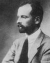

###
Esterházy Móric (1881-1960)

   {.center}

Tanulmányait a szülői háznál kezdte, majd 1899 és 1904 között a budapesti és az oxfordi egyetem hallgatója volt. Itt ismerte meg Lord Halifaxot (teljes nevén: Edward Frederick Lindley Wood, Halifax Earlje), – Anglia későbbi külügyminiszterét – akihez szoros barátság fűzte.

Az egyetem elvégzése után hosszabb utazást tett Európában és Észak-Amerikában. 1905-ben kapcsolódott be a politikai életbe, amikor örökös jogon a főrendiházban foglalt helyet. A következő évben az ifj. Andrássy Gyula gróf lemondásával megüresedett tőketerebesi kerületben független 67-es programmal szerzett mandátumot, s ugyanitt 1910-ben és 1918-ban is elnyerte a választók bizalmát.

Az első világháborúban önkéntesként harcolt a szerb, illetve az orosz fronton a 9. huszárezred tartalékos főhadnagyaként. 1917-ben előbb tartalékos századossá, június 15-én pedig Tisza István menesztése után IV. Károly király miniszterelnökké nevezte ki, de nem sokára rá, alig két hónapos kormányzás után lemondott.

A kormányát követő Wekerle-kabinetben 1918. január 25-től május 8-ig tárca nélküli miniszteri (ténylegesen: népegészségügyi) posztot vállalt, s rövid ideig a Vallás- és Közoktatásügyi Minisztérium vezetésével bízták meg.

A Tanácsköztársaság alatt a csákvári földműves iskolát vezette, a proletárdiktatúra bukása után visszavonultan gazdálkodott birtokain. A politikába 1931-ben tért vissza ismét, amikor a Keresztény Gazdasági és Szociális Párt színeiben jelöltséget vállalt a tapolcai kerületben, ahol meg is választották képviselőjükké. Széles körű bel- és külföldi publikációival keltett feltűnést. Pártjában már a kezdetekben nagy tekintélyre tett szert, elnyerte annak bizalmát, amelynek köszönhetően tagja lett a 33-as Országos Bizottságnak, ahol gyakori felszólalásaival többször sikerült az adófizetők és általában a magángazdaság érdekében jelentős könnyítéseket elfogadtatnia.

Kezdeményezésére vezethető vissza egy, a részvényjog reformját célzó mozgalom megalapítása és az uzsoratörvény-javaslat. Az 1939 és 1944 között az Egyesült Keresztény Párt képviselőjeként a Magyar Élet Pártjának Zala vármegyei listájáról jutott be a Képviselőházba. Támogatta Kállay Miklósnak a második világháborúból történő kiugrási politikáját, amiért a nyilas hatalomátvételt követően a Gestapo (német titkos államrendőrség) 1944. október 16-án letartóztatta, a kormány pedig deportálta.

Kezdetben a Margit körúti katonai fogházban, később Sopronkőhidán raboskodott. 1945 februárjában a mauthauseni koncentrációs táborba hurcolták, ahonnan szeptemberben térhetett vissza Magyarországra. 1951-ben családjával és idős édesanyjával együtt a kommunisták a fővárosból a Nógrád megyei Hortra telepítették ki. Internálása alatt sírásóként dolgozott. 1956-ban lányával Bécsbe emigrált, ott az unokaöccse által felajánlott lakásban, a Schwarzenberg-palotában élte le hátralévő négy évét, ahol 1960-ban hunyt el. Mariazellben nyugszik.

Miniszterelnöksége A Ferenc József halála után trónra lépő új, a politikai ügyekben még kevésbé tájékozott IV. Károly király már 1917 januárjában is felvetette Tisza István menesztését, de erre akkor nem került sor. Miután a király április 28-i utasítása után sem tudott a kormány a népjóléti intézkedésekről és a választójog kiterjesztéséről javaslatot előterjeszteni, az uralkodó lemondásra szólította fel Tiszát, amit ő május 23-án be is adott. Ezután Károly király több párttal tárgyalt, mindvégig eredménytelenül. Az Alkotmánypárt és Apponyi Függetlenségi 48-as és Kossuth Pártja, azon belül is ifj. Andrássy Gyula és Wekerle Sándor került előtérbe.

Sokak meglepődésére június 8-án a politikai életben kevéssé ismert 36 éves _Esterházy Móric grófot_ kérte fel IV. Károly kormányalakításra.

Kormányába jobbára Andrássy hívei kerültek, de a mérsékelt ellenzék másik két pártja egy-egy, valamint a baloldali ellenzék is két tárcát kapott.

A kormány június 21-én mutatkozott be a képviselőházban. Célkitűzései, elsősorban a szociális reformok és a választójog kiterjesztés, a Nemzeti Munkapárt parlamenti többsége miatt zátonyra futottak, így a kabinet csakhamar válságba sodródott. A földmunkás szakegyesületek alapszabályainak jóváhagyására nehezen, míg a bányászokéra egyáltalán nem lehetett rábeszélni. A tervek között szerepelt még az üzemek militarizálásának enyhítése, de a gyakorlatban ez sem valósult meg. Egymást követték a kudarcok, amivel a kormány elvesztette a tekintélyét.

A kiútra kétféle megoldás volt elképzelhető. Az egyik, hogy szövetségbe lépnek Tiszával, vagy a képviselőház feloszlatásával és a nép segítségével rákényszerítik a munkapártra a mérsékelt reformokat, de Esterházy mindkét lehetőség elől kitért, és augusztus 19-én benyújtotta lemondását. A másnap kinevezett Wekerle Sándor átvette a leköszönt kormány valamennyi tagját. Esterházy Móric és kabinetje hivatalosan augusztus 23-ig maradt hivatalban.

Forrás: [Wiki](http://hu.wikipedia.org/wiki/Esterh%C3%A1zy_M%C3%B3ric)
