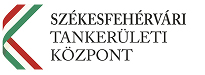

[map-leaflet height=200px lat=47.39322 lng=18.46354 zoom=16 mapname=csakvari style=neighbourhood scale ]
[a-markers markerColor="darkblue" iconColor="white"]
[{ "lat": 47.39322, "lng": 18.46354, "icon": "", "title": "Nagyiskola" } ]
[/a-markers]
[a-markers markerColor="darkgreen" iconColor="white"]
[{ "lat": 47.39239, "lng": 18.46132, "icon": "", "title": "Kisiskola" } ]
[/a-markers]
[/map-leaflet]
    <h1 class="contact-title">Esterházy Móric Nyelvoktató Német Nemzetiségi Általános Iskola</h1>
    
8083 Csákvár, Szabadság tér 8.

    
<a href="tel:+3622582310"><i class="fa fa-phone"></i>06-22/582-310</a>
        

        Igazgató: 21-es mellék 
        Alsó tagozat - tanári szoba: 22-es mellék 
        Iskolatitkár és faxküldés: 23-as mellék
        

    

    <a href="mailto:igazgato@esterhazyiskola.hu"><i class="fa fa-at"></i>Igazgató</a> 
    <a href="mailto:ighcsakvar@gmail.com"><i class="fa fa-at"></i>Igazgató helyettesek</a> 
    <a href="mailto:titkárság@esterhazyiskola.hu"><i class="fa fa-at"></i>Titkárság</a> 
    <a href="https://www.facebook.com/Esterh%C3%A1zy-M%C3%B3ric-%C3%81ltal%C3%A1nos-Iskola-Cs%C3%A1kv%C3%A1r-146915029013117"><i class="fa fa-facebook"></i></a>
    
<i class="fa fa-clock-o"></i>
        

            
            Ügyintézés: 8:00 - 16:00
        

    

    

[map-leaflet height=200px lat=47.39212 lng=18.38827 zoom=14 mapname=ganti style=neighbourhood scale ]
[a-markers markerColor="darkred" iconColor="white"]
[{ "lat": 47.39212, "lng": 18.38827, "icon": "", "title": "Gánti&nbsp;Telephely" } ]
[/a-markers]
[/map-leaflet]
    <h1 class="contact-title">Esterházy Móric Nyelvoktató Német Nemzetiségi Általános Iskola - Gánti telephely</h1>
    
8082 Gánt, Béke tér 20.

    

    

[map-leaflet height=200px lat=47.18976 lng=18.41188 zoom=16 mapname=tankerulet style=neighbourhood scale ]
[a-markers markerColor="yellow" iconColor="blue"]
[{ "lat": 47.18976, "lng": 18.41188, "icon": "", "title": "Székesfehérvári&nbsp;TK" } ]
[/a-markers]
[/map-leaflet]
    <h1 class="contact-title">Székesfehérvári Tankerületi Központ</h1>
    
8000 Székesfehérvár, Petőfi utca 5.

    
<a href="tel:+3622795240"><i class="fa fa-phone"></i>06-22/795-240</a>
        
    

    
    
<i class="fa fa-clock-o"></i>
        

            
            Ügyintézés: 8:00 - 16:00
        

    

        

            
    

